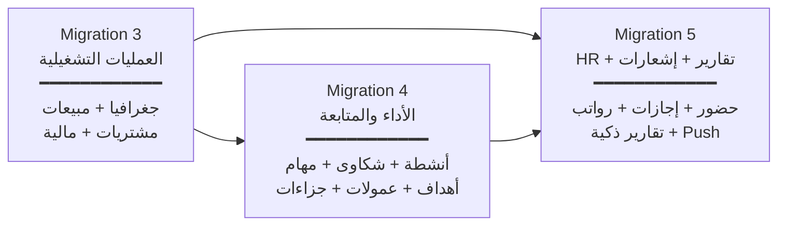

# 🗺️ خارطة طريق EDARA — النسخة المدمجة النهائية

> **3 مراحل (Migrations)** تحتوي على كل الوظائف بدون أي اختزال
> بوابة العملاء مؤجلة لما بعد التشغيل
> تاريخ الإعداد: 2026-03-13

---

## هيكل المراحل



---

# 📦 Migration 3: العمليات التشغيلية

> الجغرافيا + المبيعات الكاملة + المشتريات الكاملة + النظام المالي المتكامل

---

## القسم 1: البنية الجغرافية والفروع

### جداول DB

| # | الجدول | الأعمدة الرئيسية | الوصف |
|---|--------|-----------------|-------|
| 1 | `governorates` | `id`, `name`, `name_en`, `sort_order` | المحافظات المصرية (seed data) |
| 2 | `cities` | `id`, `governorate_id` FK, `name`, `name_en`, `sort_order` | المدن (seed data) |
| 3 | `areas` | `id`, `city_id` FK, `name` | المناطق (اختياري - مستوى أدق) |
| 4 | `branches` | `id`, `name`, `city_id` FK, `address`, `phone`, `manager_id` FK profiles, `is_active` | الفروع |

### تعديلات على جداول موجودة

| الجدول | التعديل |
|--------|--------|
| `customers` | + `governorate_id` FK, + `city_id` FK, + `area_id` FK |
| `employees` | + `branch_id` FK |
| `warehouses` | + `branch_id` FK |
| `suppliers` | + `current_balance` NUMERIC(12,2) DEFAULT 0 |
| `company_settings` | + إعدادات: `max_discount_percent`, `allow_rep_discount`, `require_order_approval` |

### واجهات

- صفحة إعدادات المناطق الجغرافية (محافظات ← مدن ← مناطق)
- صفحة الفروع (إنشاء + تعديل + ربط بمدينة ومخزن)
- تحديث نموذج العميل (إضافة حقول المنطقة الجغرافية)

---

## القسم 2: وحدة المبيعات الكاملة

### جداول DB

| # | الجدول | الأعمدة الرئيسية | الوصف |
|---|--------|-----------------|-------|
| 5 | `sales_orders` | `id`, `order_number` UNIQUE, `customer_id` FK, `sales_rep_id` FK, `warehouse_id` FK, `status` (draft/confirmed/cancelled), `order_date`, `delivery_method`, `shipping_company_id` FK NULL, `payment_method` (cash/credit), `subtotal`, `discount_amount`, `discount_percent`, `tax_amount`, `total_amount`, `notes`, `confirmed_by` FK, `confirmed_at`, `created_by` FK, `branch_id` FK | أمر البيع |
| 6 | `sales_order_items` | `id`, `order_id` FK, `product_id` FK, `unit_id` FK, `quantity`, `unit_price`, `discount_amount`, `discount_percent`, `tax_amount`, `total`, `conversion_factor`, `base_quantity` (بالوحدة الأساسية) | بنود أمر البيع |
| 7 | `sales_returns` | `id`, `return_number` UNIQUE, `order_id` FK, `customer_id` FK, `warehouse_id` FK, `status` (draft/confirmed/cancelled), `return_date`, `total_amount`, `reason`, `notes`, `confirmed_by`, `confirmed_at`, `created_by` | مرتجع مبيعات |
| 8 | `sales_return_items` | `id`, `return_id` FK, `order_item_id` FK (بند الطلب الأصلي), `product_id` FK, `unit_id` FK, `quantity`, `unit_price`, `total`, `conversion_factor`, `base_quantity` | بنود المرتجع (**جزئي** — بند واحد أو كمية جزئية) |
| 9 | `discount_rules` | `id`, `name`, `type` (product/invoice/quantity/bundle/cash_payment), `scope` (company/customer/category/product), `scope_id` UUID NULL, `value` (نسبة أو مبلغ), `is_percentage` BOOL, `min_qty` NULL, `max_qty` NULL, `start_date`, `end_date`, `is_active`, `created_by` | قواعد الخصومات |
| 10 | `discount_rule_items` | `id`, `rule_id` FK, `product_id` FK, `quantity`, `free_quantity` | بنود الخصم (لعروض الباندل) |
| 11 | `payment_proofs` | `id`, `reference_type` (sales_order/customer_payment), `reference_id`, `image_url`, `payment_method` (bank_transfer/instapay), `amount`, `status` (pending/approved/rejected), `uploaded_by` FK, `reviewed_by` FK, `reviewed_at`, `notes` | إثباتات الدفع |

### وظائف DB (Atomic)

| الوظيفة | المدخلات | ما تفعله |
|---------|---------|---------|
| `generate_order_number(type)` | 'SO'/'SR'/'PO'/'PR' | رقم تسلسلي مع advisory lock (مثل `generate_transaction_number`) |
| `confirm_sales_order(order_id, user_id)` | UUID, UUID | ① فحص `credit_limit` للآجل ← ② خصم مخزون (بالوحدة الأساسية `base_quantity`) ← ③ تحديث `current_balance` للعميل (إذا آجل) ← ④ تحديث عهدة/خزنة (إذا نقدي) ← ⑤ إنشاء حركات مخزون ← ⑥ إنشاء قيد محاسبي تلقائي |
| `confirm_sales_return(return_id, user_id)` | UUID, UUID | عكس **جزئي**: ① إرجاع `base_quantity` للمخزون ← ② تعديل رصيد العميل ← ③ عكس الحركة المالية ← ④ قيد عكسي (المرتجع قد يشمل بند واحد أو كمية جزئية من بند) |
| `check_credit_limit(customer_id, amount)` | UUID, NUMERIC | فحص: `current_balance + amount ≤ credit_limit` + فحص موافقة الآجل |
| `get_product_price(product_id, customer_id, unit_id, qty)` | UUIDs + NUMERIC | جلب السعر من قائمة أسعار العميل → أو القائمة الافتراضية → مع مراعاة الوحدة والكمية |

### واجهات

- صفحة طلبات البيع (قائمة + بحث + فلاتر حسب الحالة/التاريخ/العميل/المندوب)
- نموذج إنشاء طلب بيع:
  - اختيار عميل ← سعر تلقائي من قائمته
  - إضافة منتجات ← اختيار الوحدة ← السعر يتحدث تلقائياً
  - خصم على المنتج أو على الفاتورة (ضمن الحد المسموح)
  - اختيار: نقدي / آجل (مع فحص ائتماني)
  - اختيار: توصيل الشركة / شحن / استلام
  - اختيار المخزن (رئيسي / سيارة)
- صفحة تفاصيل الطلب (مع أزرار: تأكيد / إلغاء / إنشاء مرتجع)
- صفحة مرتجعات المبيعات (اختيار بنود محددة أو كميات جزئية من الطلب الأصلي)
- شاشة مراجعة إثباتات الدفع (صورة + موافقة/رفض)
- صفحة قواعد الخصومات (إنشاء + تعديل + تفعيل/تعطيل)

### القواعد الذكية

- فحص ائتماني تلقائي قبل تأكيد طلب آجل
- فحص موافقة العميل على الآجل
- خصم بحد أقصى من `company_settings.max_discount_percent`
- صلاحية الخصم مرتبطة بـ `company_settings.allow_rep_discount`
- السعر من قائمة أسعار العميل → الافتراضية
- المخزون يُخصم بالوحدة الأساسية (تحويل تلقائي)
- المرتجع يدعم: مرتجع جزئي (بند واحد) + مرتجع كمية جزئية من بند

---

## القسم 3: وحدة المشتريات الكاملة

### جداول DB

| # | الجدول | الأعمدة الرئيسية | الوصف |
|---|--------|-----------------|-------|
| 12 | `purchase_orders` | `id`, `order_number` UNIQUE, `supplier_id` FK, `warehouse_id` FK, `status` (draft/approved/partially_received/received/cancelled), `order_date`, `payment_method`, `subtotal`, `tax_amount`, `total_amount`, `notes`, `approved_by` FK, `approved_at`, `created_by` FK, `branch_id` FK | أمر شراء |
| 13 | `purchase_order_items` | `id`, `order_id` FK, `product_id` FK, `unit_id` FK, `quantity`, `unit_price`, `tax_amount`, `total`, `conversion_factor`, `base_quantity`, `received_quantity` | بنود أمر الشراء |
| 14 | `purchase_receipts` | `id`, `receipt_number` UNIQUE, `purchase_order_id` FK, `warehouse_id` FK, `status` (pending_approval/approved/rejected), `received_date`, `received_by` FK, `approved_by` FK (أمين المخزن أو مدير), `approved_at`, `notes` | إذن استلام |
| 15 | `purchase_receipt_items` | `id`, `receipt_id` FK, `order_item_id` FK, `product_id` FK, `unit_id` FK, `ordered_quantity`, `received_quantity`, `accepted_quantity`, `rejected_quantity`, `rejection_reason`, `batch_number`, `expiry_date`, `conversion_factor`, `base_quantity` | بنود الاستلام (مقارنة مطلوب vs فعلي) |
| 16 | `purchase_returns` | `id`, `return_number` UNIQUE, `supplier_id` FK, `warehouse_id` FK, `purchase_order_id` FK NULL, `status`, `return_date`, `total_amount`, `reason`, `notes`, `confirmed_by`, `confirmed_at`, `created_by` | مرتجع مشتريات |
| 17 | `purchase_return_items` | `id`, `return_id` FK, `product_id` FK, `unit_id` FK, `quantity`, `unit_price`, `total`, `conversion_factor`, `base_quantity` | بنود مرتجع مشتريات (جزئي أيضاً) |

### وظائف DB (Atomic)

| الوظيفة | ما تفعله |
|---------|---------|
| `approve_purchase_order(po_id, user_id)` | تغيير الحالة + إنشاء إشعار لأمين المخزن |
| `approve_purchase_receipt(receipt_id, user_id)` | ① إضافة مخزون (بالوحدة الأساسية) ← ② تحديث `current_balance` للمورد (إذا آجل) ← ③ حركات مخزون ← ④ تحديث `received_quantity` في PO items ← ⑤ قيد محاسبي تلقائي |
| `confirm_purchase_return(return_id, user_id)` | عكس جزئي: خصم مخزون ← تعديل رصيد مورد ← قيد عكسي |

### واجهات

- صفحة أوامر الشراء (قائمة + فلاتر + حالات)
- نموذج إنشاء أمر شراء (مورد ← منتجات ← كميات ← أسعار)
- شاشة الاستلام (مقارنة: مطلوب vs مستلم vs مقبول vs مرفوض + سبب الرفض)
- إشعار أمين المخزن للموافقة على الاستلام (أو موافقة المدير مباشرة)
- صفحة مرتجعات الموردين

---

## القسم 4: النظام المالي المتكامل

### جداول DB

| # | الجدول | الأعمدة الرئيسية | الوصف |
|---|--------|-----------------|-------|
| 18 | `chart_of_accounts` | `id`, `code`, `name`, `type` (asset/liability/equity/revenue/expense), `parent_id` FK self, `is_active`, `is_system` | شجرة الحسابات |
| 19 | `fiscal_periods` | `id`, `name`, `start_date`, `end_date`, `status` (open/closed), `closed_by` | الفترات المحاسبية |
| 20 | `journal_entries` | `id`, `entry_number` UNIQUE, `date`, `description`, `source_type` (sales_order/purchase_receipt/expense/manual...), `source_id` UUID, `status` (draft/posted), `total_debit`, `total_credit`, `fiscal_period_id` FK, `posted_by`, `posted_at`, `created_by` | القيود المحاسبية |
| 21 | `journal_entry_lines` | `id`, `entry_id` FK, `account_id` FK chart_of_accounts, `debit`, `credit`, `description` | بنود القيد |
| 22 | `vaults` | `id`, `name`, `type` (cash/bank/mobile_wallet), `account_number`, `bank_name`, `current_balance`, `responsible_id` FK profiles, `branch_id` FK, `is_active` | الخزائن والبنوك |
| 23 | `vault_transactions` | `id`, `vault_id` FK, `type` (deposit/withdrawal/transfer_in/transfer_out/collection/payment/expense), `amount`, `balance_after`, `reference_type`, `reference_id`, `description`, `created_by`, `created_at` | حركات الخزنة |
| 24 | `custody_accounts` | `id`, `employee_id` FK, `current_balance`, `max_balance`, `is_active` | عهدة الموظفين |
| 25 | `custody_transactions` | `id`, `custody_id` FK, `type` (load/collection/expense/settlement/return), `amount`, `balance_after`, `reference_type`, `reference_id`, `description`, `created_by`, `created_at` | حركات العهدة |
| 26 | `expense_categories` | `id`, `name`, `parent_id` FK self, `is_active` | بنود المصروفات (ديناميكي هرمي) |
| 27 | `expenses` | `id`, `expense_number` UNIQUE, `category_id` FK, `amount`, `vault_id` FK NULL, `custody_id` FK NULL, `status` (draft/pending_approval/approved/rejected/paid), `description`, `receipt_url`, `requested_by` FK, `approved_by` FK, `approved_at`, `rejection_reason`, `branch_id` FK, `expense_date` | المصروفات |
| 28 | `customer_payments` | `id`, `payment_number` UNIQUE, `customer_id` FK, `amount`, `payment_method` (cash/bank_transfer/instapay/check), `vault_id` FK NULL, `custody_id` FK NULL, `collected_by` FK, `status` (pending/confirmed/cancelled), `payment_date`, `notes`, `proof_id` FK payment_proofs NULL | سداد العملاء |
| 29 | `supplier_payments` | `id`, `payment_number` UNIQUE, `supplier_id` FK, `amount`, `payment_method`, `vault_id` FK, `status`, `payment_date`, `notes`, `created_by` | سداد الموردين |
| 30 | `approval_rules` | `id`, `type` (expense/purchase_order/discount_override), `role_id` FK NULL, `user_id` FK NULL, `max_amount`, `requires_escalation_above`, `is_active` | قواعد الاعتماد (حد أقصى لكل مستوى) |

### وظائف DB (Atomic)

| الوظيفة | ما تفعله |
|---------|---------|
| `record_customer_payment(...)` | ① تحديث `current_balance` للعميل ← ② حركة خزنة أو عهدة ← ③ قيد تلقائي |
| `record_supplier_payment(...)` | ① تحديث `current_balance` للمورد ← ② خصم من خزنة ← ③ قيد تلقائي |
| `approve_expense(expense_id, user_id)` | ① فحص حد الموافقة من `approval_rules` ← ② تصعيد إذا تجاوز الحد ← ③ خصم من خزنة/عهدة ← ④ قيد تلقائي |
| `transfer_between_vaults(from, to, amount, user_id)` | ① خصم من المصدر ← ② إضافة للوجهة ← ③ حركتان ← ④ قيد تلقائي |
| `settle_custody(employee_id, vault_id, user_id)` | ① تسوية العهدة مع الخزنة ← ② تصفير/تحديث رصيد العهدة ← ③ قيد تلقائي |
| `auto_journal_entry(source_type, source_id)` | إنشاء قيد تلقائي من أي عملية (بيع/شراء/تحصيل/مصروف) |
| `can_approve(user_id, type, amount)` | فحص هل المستخدم يملك صلاحية اعتماد هذا المبلغ |

### واجهات

- لوحة الخزائن (بطاقات أرصدة + آخر الحركات)
- صفحة حركات الخزنة (إيداع / سحب يدوي)
- صفحة تحويل بين الخزائن
- صفحة عهدة الموظفين (رصيد + تحصيلات + مصروفات + تسوية)
- صفحة المصروفات (إنشاء → طلب اعتماد → موافقة/رفض)
- صفحة بنود المصروفات (إنشاء/تعديل ديناميكي)
- صفحة سداد العملاء (تسجيل + ربط بفواتير + مراجعة إثبات)
- صفحة سداد الموردين
- صفحة شجرة الحسابات (عرض هرمي)
- صفحة القيود المحاسبية (عرض فقط — تُنشأ تلقائياً)
- صفحة قواعد الاعتماد (ضبط الحدود لكل مستوى)

### صلاحيات جديدة (permissions seed)

```
finance.vaults.create/read/update
finance.vaults.transfer
finance.custody.read/manage
finance.expenses.create/read/approve
finance.customer_payments.create/read
finance.supplier_payments.create/read
sales.orders.create/read/update/confirm/cancel
sales.returns.create/read/confirm
sales.discounts.manage
purchases.orders.create/read/approve
purchases.receipts.create/read/approve
purchases.returns.create/read/confirm
```

---

# 📊 Migration 4: الأداء والمتابعة

> الأنشطة + الشكاوى + المهام + الأهداف (OKR) + العمولات + سياسات الائتمان والجزاءات

---

## القسم 1: الأنشطة الشاملة

### جداول DB

| # | الجدول | الأعمدة الرئيسية | الوصف |
|---|--------|-----------------|-------|
| 31 | `activity_types` | `id`, `name`, `icon`, `color`, `is_system`, `is_active` | أنواع الأنشطة (زيارة/مكالمة/تواصل/مهمة تشغيلية/مهمة إدارية) |
| 32 | `activities` | `id`, `activity_type_id` FK, `employee_id` FK, `customer_id` FK NULL, `supplier_id` FK NULL, `order_id` FK NULL, `subject`, `description`, `outcome`, `gps_lat`, `gps_lng`, `duration_minutes`, `activity_date`, `created_by` FK | سجل الأنشطة الموحد |

## القسم 2: شكاوى العملاء

### جداول DB

| # | الجدول | الأعمدة الرئيسية | الوصف |
|---|--------|-----------------|-------|
| 33 | `complaint_categories` | `id`, `name`, `is_active` | فئات الشكاوى (جودة/تأخير/خطأ...) |
| 34 | `complaints` | `id`, `complaint_number` UNIQUE, `customer_id` FK, `order_id` FK NULL, `product_id` FK NULL, `category_id` FK, `priority` (low/medium/high/critical), `status` (open/in_progress/resolved/closed), `subject`, `description`, `assigned_to` FK, `resolved_by` FK, `resolved_at`, `resolution_notes`, `sla_hours`, `created_by` FK | الشكاوى |
| 35 | `complaint_actions` | `id`, `complaint_id` FK, `action_type` (note/status_change/assignment/resolution), `description`, `created_by` FK, `created_at` | سجل المتابعة والإجراءات |

## القسم 3: المهام

### جداول DB

| # | الجدول | الأعمدة الرئيسية | الوصف |
|---|--------|-----------------|-------|
| 36 | `tasks` | `id`, `title`, `description`, `assigned_to` FK, `assigned_by` FK, `priority`, `status` (todo/in_progress/done/cancelled), `due_date`, `completed_at`, `related_type` (customer/order/complaint), `related_id` UUID NULL | المهام |

## القسم 4: الأهداف (OKR + KPI)

### جداول DB

| # | الجدول | الأعمدة الرئيسية | الوصف |
|---|--------|-----------------|-------|
| 37 | `target_types` | `id`, `name`, `code` (sales_value/sales_qty/collection/visits/calls/new_customers/invoices/product_sales/category_sales), `measurement_unit` (currency/count/percentage), `auto_track_source` (sales_orders/customer_payments/activities/customers/...), `is_active` | أنواع الأهداف |
| 38 | `targets` | `id`, `target_type_id` FK, `name`, `scope` (company/department/individual), `scope_id` UUID, `period_type` (monthly/quarterly/yearly), `period_start`, `period_end`, `target_value`, `min_acceptable`, `stretch_value`, `product_id` FK NULL, `category_id` FK NULL, `governorate_id` FK NULL, `city_id` FK NULL, `parent_target_id` FK self NULL, `is_active`, `created_by` | الأهداف (هرمية: شركة ← قسم ← فرد) |
| 39 | `target_progress` | `id`, `target_id` FK, `date`, `achieved_value`, `achievement_percentage`, `last_calculated_at` | تقدم الأهداف (يُحدّث تلقائياً) |

## القسم 5: العمولات

### جداول DB

| # | الجدول | الأعمدة الرئيسية | الوصف |
|---|--------|-----------------|-------|
| 40 | `commission_schemes` | `id`, `name`, `description`, `calculation_basis` (sales_value/collection/profit), `is_active`, `start_date`, `end_date` | أنظمة العمولات |
| 41 | `commission_rules` | `id`, `scheme_id` FK, `type` (percentage/fixed), `value`, `min_threshold`, `max_threshold`, `product_id` FK NULL, `category_id` FK NULL, `customer_id` FK NULL, `governorate_id` FK NULL, `city_id` FK NULL, `priority` (لحل التعارضات) | قواعد العمولة (جغرافية + منتج + عميل + شرائح) |
| 42 | `commission_assignments` | `id`, `scheme_id` FK, `employee_id` FK, `start_date`, `end_date` | ربط الموظف بنظام عمولة |
| 43 | `commission_calculations` | `id`, `employee_id` FK, `scheme_id` FK, `period_start`, `period_end`, `total_basis_amount` (إجمالي المبيعات/التحصيل), `commission_amount`, `status` (calculated/approved/paid), `approved_by`, `approved_at`, `details` JSONB | حسابات العمولة الشهرية |

## القسم 6: سياسات الائتمان والجزاءات

### جداول DB

| # | الجدول | الأعمدة الرئيسية | الوصف |
|---|--------|-----------------|-------|
| 44 | `credit_policies` | `id`, `name`, `level` (1/2/3/4), `days_overdue_trigger`, `action_type` (notify_rep/notify_supervisor/freeze_credit/escalate), `penalty_type` (none/commission_deduction/warning), `penalty_value`, `auto_freeze_credit` BOOL, `is_active` | سياسات التأخر (مستويات متدرجة) |
| 45 | `credit_violations` | `id`, `customer_id` FK, `sales_rep_id` FK, `policy_id` FK, `invoice_id` FK NULL, `overdue_amount`, `overdue_days`, `action_taken`, `resolved` BOOL, `resolved_at`, `resolved_by`, `notes`, `created_at` | مخالفات التأخر (تُنشأ تلقائياً) |

### وظائف DB

| الوظيفة | ما تفعله |
|---------|---------|
| `calculate_target_progress(target_id)` | حساب نسبة الإنجاز من الجداول الفعلية حسب `auto_track_source` |
| `refresh_all_targets(period)` | تحديث كل الأهداف لفترة معينة |
| `calculate_monthly_commissions(employee_id, year, month)` | حساب عمولة شهرية مع: قواعد جغرافية + منتج + شرائح + ربط بالتحصيل |
| `check_credit_violations()` | فحص دوري: عملاء متأخرون → إنشاء مخالفات → إشعارات → تجميد تلقائي |
| `apply_credit_penalty(violation_id)` | تطبيق الجزاء حسب المستوى |

### واجهات

- صفحة الأنشطة (فلتر: نوع/موظف/عميل/تاريخ + عرض GPS على الخريطة)
- نموذج تسجيل نشاط (نوع ← تفاصيل ← عميل/مورد ← GPS)
- صفحة الشكاوى (قائمة + أولويات + حالات + SLA + بحث)
- نموذج شكوى (ربط: عميل + طلب اختياري + منتج اختياري + فئة + أولوية)
- تفاصيل شكوى (سجل الإجراءات + تعيين مسؤول + تتبع الوقت)
- لوحة المهام (تعيين لأي موظف + متابعة + إنجاز + أولويات)
- لوحة الأهداف (شجرة هرمية: شركة ← قسم ← فرد مع أشرطة تقدم بصرية)
- نموذج تعريف هدف (8+ أنواع + فترة + قيمة + ربط بمنتج/فئة/منطقة)
- صفحة أنظمة العمولات (تعريف النظام + القواعد + الشرائح + المناطق)
- ربط موظفين بأنظمة عمولات
- تقرير العمولات الشهري (حساب + تفاصيل + اعتماد)
- صفحة سياسات الائتمان (تعريف المستويات + الأيام + الجزاءات)
- صفحة مخالفات التأخر (قائمة + معالجة + حل)

### صلاحيات جديدة

```
activities.activities.create/read
activities.complaints.create/read/update/resolve
activities.tasks.create/read/update
targets.targets.create/read/update/delete
targets.progress.read
commissions.schemes.create/read/update
commissions.calculations.read/approve
credit.policies.create/read/update
credit.violations.read/resolve
```

---

# 👥 Migration 5: HR المتقدم + التقارير + الإشعارات

> الحضور + الإجازات + الرواتب + الصلاحيات المخصصة + التقارير الذكية + إشعارات Push

---

## القسم 1: HR المتقدم

### جداول DB

| # | الجدول | الأعمدة الرئيسية | الوصف |
|---|--------|-----------------|-------|
| 46 | `work_shifts` | `id`, `name`, `start_time`, `end_time`, `grace_minutes`, `is_active` | الورديات |
| 47 | `employee_shift_assignments` | `id`, `employee_id` FK, `shift_id` FK, `start_date`, `end_date` | ربط الموظف بالوردية |
| 48 | `employee_attendance` | `id`, `employee_id` FK, `date`, `check_in`, `check_out`, `check_in_lat`, `check_in_lng`, `check_out_lat`, `check_out_lng`, `status` (present/absent/late/early_leave/day_off), `work_hours`, `overtime_hours`, `notes`, `shift_id` FK | الحضور والانصراف |
| 49 | `leave_types` | `id`, `name`, `is_paid`, `max_days_per_year`, `is_active` | أنواع الإجازات |
| 50 | `employee_leaves` | `id`, `employee_id` FK, `leave_type_id` FK, `start_date`, `end_date`, `days_count`, `status` (pending/approved/rejected), `reason`, `approved_by`, `approved_at`, `rejection_reason` | طلبات الإجازات |
| 51 | `leave_balances` | `id`, `employee_id` FK, `leave_type_id` FK, `year`, `total_days`, `used_days`, `remaining_days` | أرصدة الإجازات |
| 52 | `payroll_runs` | `id`, `period_month`, `period_year`, `status` (draft/calculated/approved/paid), `total_amount`, `created_by`, `approved_by`, `approved_at` | كشف الرواتب الشهري |
| 53 | `payroll_items` | `id`, `payroll_id` FK, `employee_id` FK, `base_salary`, `allowances`, `commissions`, `bonuses`, `deductions`, `penalties`, `overtime_amount`, `net_salary`, `details` JSONB | بنود الراتب لكل موظف |
| 54 | `rewards_penalties` | `id`, `employee_id` FK, `type` (reward/penalty), `amount`, `reason`, `related_type` (credit_violation/attendance/performance/manual), `related_id` UUID NULL, `applied_to_payroll_id` FK NULL, `created_by` | مكافآت وجزاءات |
| 55 | `user_permissions_override` | `id`, `user_id` FK, `permission_id` FK, `granted` BOOL, `granted_by` FK, `expires_at` | صلاحيات مخصصة على مستوى المستخدم (override) |

### وظائف DB

| الوظيفة | ما تفعله |
|---------|---------|
| `calculate_payroll(month, year)` | حساب تلقائي: أساسي + بدلات + عمولات (من M4) + مكافآت - خصومات - جزاءات = صافي |
| `record_attendance(employee_id, type, gps)` | تسجيل حضور/انصراف مع حساب التأخر من الوردية |
| `approve_leave(leave_id, user_id)` | اعتماد + خصم من الرصيد |
| `get_user_permissions_v2(user_id)` | نسخة محدثة تدعم `user_permissions_override` |

### واجهات

- صفحة الحضور والانصراف (يومي + شهري + ملخصات)
- تسجيل حضور عبر GPS
- صفحة الورديات (تعريف + تعيين)
- صفحة الإجازات (طلب + اعتماد + رفض + رصيد)
- صفحة أنواع الإجازات
- صفحة كشف الرواتب (حساب تلقائي + تفاصيل + اعتماد)
- صفحة المكافآت والجزاءات
- ملف الموظف الشامل (Dashboard):
  | القسم | المحتوى |
  |-------|---------| 
  | بيانات أساسية | الاسم، القسم، الفرع، المسمى، تاريخ التعيين |
  | مالي | الراتب، المكافآت، الخصومات، العمولات |
  | حضور | ملخص شهري + تفاصيل يومية |
  | إجازات | رصيد + سجل |
  | أنشطة | آخر الأنشطة + إحصائيات |
  | أهداف | نسبة إنجاز + تفاصيل |
  | عملاء | العملاء المسندين (للمندوبين) |
- صلاحيات مستخدم مخصصة (في صفحة المستخدم — override لصلاحيات الدور)

---

## القسم 2: التقارير الذكية

### Materialized Views / DB Functions

| التقرير | المصدر | النوع |
|---------|--------|------|
| مبيعات بالفترة/عميل/منتج/مندوب/منطقة | `sales_orders` + `items` | Materialized View |
| تقادم ديون العملاء (30/60/90 يوم) | `sales_orders` + `customer_payments` | Function |
| أداء المندوبين (مبيعات + تحصيل + زيارات + أهداف) | متعدد | Function |
| حالة المخزون (منخفض + راكد + قريب انتهاء) | `stock` + `stock_batches` + `products` | View |
| أرباح وخسائر | `journal_entries` + `journal_entry_lines` | Function |
| أداء العملاء (أعلى مبيعات + مديونية + راكدون) | `sales_orders` + `customers` | Function |
| أداء المنتجات (أكثر/أقل مبيعاً + هامش ربح) | `sales_order_items` + `products` | Function |
| مقارنات دورية (شهر/سنة) | كل ما سبق | Function |

### واجهات — لوحة القيادة (3 مستويات)

| المستوى | يرى | المحتوى |
|---------|------|---------|
| **CEO** | كل الشركة | إيرادات/مصروفات/أرباح + أداء الأقسام + عملاء في خطر + تنبيهات حرجة |
| **مدير** | قسمه | أداء الفريق + أهداف القسم + مهام معلقة + مقارنات |
| **موظف** | نفسه | مهام اليوم + أدائي + أهدافي + عمولاتي |

### واجهات — صفحات التقارير

- تقرير المبيعات (فلاتر: فترة + عميل + منتج + مندوب + منطقة)
- تقرير تقادم الديون
- تقرير أداء المندوبين
- تقرير المخزون
- تقرير أرباح وخسائر
- تقرير أداء العملاء
- تقرير أداء المنتجات
- مقارنات دورية (هذا الشهر vs السابق)

---

## القسم 3: الإشعارات الذكية

### تعديلات

| التعديل | التفاصيل |
|---------|---------|
| تعديل `notifications` | + `category`, + `priority`, + `action_url`, + `metadata` JSONB |
| جدول جديد `notification_settings` | `user_id`, `category`, `in_app` BOOL, `push` BOOL, `email` BOOL | تفضيلات الإشعارات لكل مستخدم |
| جدول جديد `push_subscriptions` | `user_id`, `endpoint`, `keys`, `device_info` | اشتراكات Push Notification |

### أحداث تستحق إشعار فوري

| الحدث | من يُبلّغ |
|-------|---------|
| طلب بيع يحتاج تأكيد | المدير/المشرف |
| أمر شراء يحتاج اعتماد | المدير |
| استلام بضاعة يحتاج موافقة | أمين المخزن |
| مصروف يحتاج اعتماد | المدير حسب الحد |
| عميل تجاوز الحد الائتماني | المدير + المندوب |
| عميل متأخر عن السداد | المندوب + المشرف |
| مخزون أقل من الحد الأدنى | أمين المخزن + المدير |
| هدف قارب على الانتهاء بدون تحقيق | الموظف + المشرف |
| شكوى جديدة / شكوى تجاوزت SLA | المسؤول المعين + المدير |
| مهمة جديدة معينة | الموظف |
| مرتجع يحتاج موافقة | المدير |
| إثبات دفع يحتاج مراجعة | المحاسب |

### صلاحيات جديدة

```
hr.shifts.create/read/update
hr.attendance.create/read
hr.leaves.create/read/approve
hr.payroll.calculate/read/approve
hr.rewards.create/read
reports.sales.read/export
reports.inventory.read/export
reports.financial.read/export
reports.performance.read/export
notifications.settings.read/update
```

---

## ⚙️ استراتيجيات مشتركة عبر كل المراحل

| الجانب | الاستراتيجية |
|--------|-------------|
| **Atomic Operations** | كل عملية مركبة في `plpgsql SECURITY DEFINER` مع `FOR UPDATE` locks |
| **Order Numbers** | `generate_order_number()` بـ `pg_advisory_xact_lock` — نفس نمط `generate_transaction_number` |
| **Audit Trail** | `fn_audit_log()` على كل جدول حساس |
| **Pagination** | إجبارية — max 50 صف |
| **Indexes** | كل FK + عمود بحث + عمود ترتيب + composite indexes للتقارير |
| **Materialized Views** | للتقارير الثقيلة مع `REFRESH` عند الحاجة |
| **Unit Conversion** | `base_quantity = quantity × conversion_factor` دائماً |
| **Partial Returns** | المرتجع يربط بـ `order_item_id` ويسمح بكمية أقل من الأصلية |
| **RLS** | على كل جدول مع `check_permission()` |
| **Idempotent** | كل migration قابل لإعادة التشغيل بأمان |

---

> [!IMPORTANT]
> **3 ملفات Migration فقط** — كل واحد يحتوي على كل الجداول + الوظائف + الفهارس + RLS + Seed Data + الصلاحيات الخاصة بقسمه.
> **لم يتم اختزال أي وظيفة** — كل ما تم ذكره في الخطة الأصلية موجود هنا.
> **بوابة العملاء مؤجلة** لما بعد التشغيل والتكامل.
